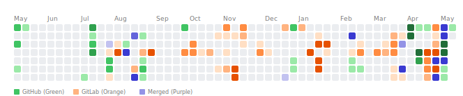

# Unified Contribution Graph Generator

A Node.js tool to generate a unified contribution graph (GitHub style) combining both GitHub and GitLab activities.



## Features
- Fetches contribution data from **GitHub GraphQL API**.
- Fetches contribution events from **GitLab REST API**.
- Merges data and generates a custom **SVG** graph.
- Automated daily updates via **GitHub Actions**.

## Setup

1. **Fork/Clone this repository.**
2. **Configure GitHub Secrets**:
   Go to `Settings > Secrets and variables > Actions` and add:
   - `GH_TOKEN`: A Personal Access Token (Classic or Fine-grained) with `repo` and `read:user` scopes.
   - `GITLAB_TOKEN`: A GitLab Personal Access Token with `read_api` scope.
   - `GITLAB_USERNAME`: Your GitLab username.
   - `GITLAB_INSTANCE_URL`: (Optional) Your GitLab instance URL (defaults to `https://gitlab.com`).
3. **The workflow runs daily at midnight UTC.** You can also trigger it manually from the `Actions` tab.

## Local Development

```bash
# Install dependencies
npm install

# Run the script (requires env variables)
export GITHUB_TOKEN=your_github_token
export GITLAB_TOKEN=your_gitlab_token
export GITLAB_USERNAME=your_gitlab_username
npx tsx src/main.ts
```

## Tech Stack
- **TypeScript**
- **Node.js**
- **Axios** (GitLab API)
- **@octokit/graphql** (GitHub API)
- **date-fns** (Date manipulation)
- **SVG** (Custom template literal generation)
